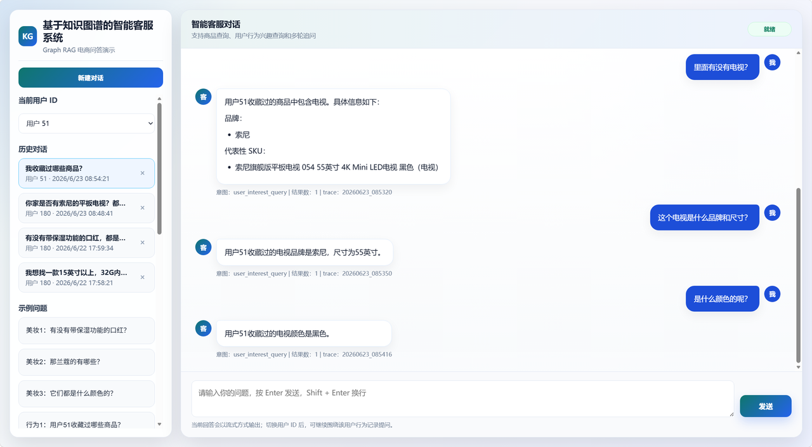

# EcomGraphAI

## 项目简介

EcomGraphAI 是一个基于 Neo4j 知识图谱与 Graph RAG 的电商智能客服系统。系统结合 MySQL 业务数据库、商品详情图片 OCR 结果与用户行为日志三类数据来源，构建电商知识图谱，支持商品属性查询、多条件筛选、用户兴趣查询以及多轮上下文追问等对话场景。

项目主要包含三部分能力：

- 从业务数据库构建商品、品牌、品类、属性等基础图谱
- 从商品详情图片中识别文字并抽取商品属性，增量补充图谱
- 基于 Graph RAG 实现面向电商客服的自然语言问答

## 项目结构

```text
EcomGraphAI/
├── src/
│   ├── configs/       # 项目路径配置
│   ├── datasync/      # MySQL、OCR、用户行为日志到 Neo4j 的同步脚本
│   ├── graphrag/      # Graph RAG 核心流程
│   ├── models/        # 拼写纠错模型结构
│   ├── preprocess/    # 数据增强与预处理脚本
│   ├── runner/        # 模型训练、评估、预测脚本
│   ├── scripts/       # 功能测试与演示脚本
│   └── web/           # FastAPI 前端客服服务
├── external_lib/      # uie_pytorch 依赖代码
├── data/              # 示例数据与数据目录占位
├── checkpoint/        # 训练后模型权重目录，需自行放置
├── pretrained/        # 预训练模型目录，需自行放置
├── logs/              # 运行日志目录
├── output/            # 运行结果目录
└── docs/              # 项目演示图片
```

## 环境准备

```text
# Python == 3.12
# Cuda == 12.8
```

```powershell
conda create -n image-vision python=3.12
conda activate image-vision
pip install torch==2.8.0 torchvision==0.23.0 torchaudio==2.8.0 --index-url https://download.pytorch.org/whl/cu128
pip install transformers datasets scikit-learn tensorboard tqdm jupyter fastapi uvicorn
```

图谱、OCR 与 Graph RAG 流程还需要以下依赖，可按需补充安装：

```powershell
pip install easyocr pymysql neo4j requests sentence-transformers jieba python-dotenv
```

## 配置说明

项目运行前需要准备 MySQL、Neo4j、大模型 API Key 以及本地模型文件。仓库中提供了 `.env.example` 作为配置模板，使用前请复制为 `.env`：

```powershell
copy .env.example .env
```

然后根据自己的本地环境修改 `.env` 中的配置：

```text
GMALL_MYSQL_HOST=localhost
GMALL_MYSQL_PORT=3306
GMALL_MYSQL_USER=root
GMALL_MYSQL_PASSWORD=your_mysql_password
GMALL_MYSQL_DATABASE=gmall

NEO4J_URI=neo4j://localhost:7687
NEO4J_USER=neo4j
NEO4J_PASSWORD=your_neo4j_password
NEO4J_DATABASE=neo4j

TONGYI_API_KEY=your_api_key
GRAPHRAG_LLM_MODEL=qwen-turbo
```

说明：

- MySQL 需要提前导入 `gmall.sql`，并保证数据库名与 `.env` 中一致
- Neo4j 需要提前启动，并确保 Bolt 端口可连接
- `TONGYI_API_KEY` 用于调用通义千问兼容接口，用户可替换为自己的大模型服务
- 模型权重、预训练模型和商品图片未随仓库提交，需要按下面说明自行准备

## 模型与资源准备

请将相关模型和资源放到对应目录。推荐目录结构如下：

```text
pretrained/
├── bge-base-zh-v1.5/
├── mengzi-t5-base-chinese-correction/
├── uie_base_pytorch/
└── easyoc/

checkpoint/
├── uie_0608/model_best/
└── spell_check_t5/best.pt

data/
├── images/
├── uie_0608/raw/doccano.jsonl
└── spell_check/raw/data.txt
```

常用资源下载地址：

- BGE 中文向量模型：https://huggingface.co/BAAI/bge-base-zh-v1.5
- Mengzi-T5 中文纠错模型：https://huggingface.co/shibing624/mengzi-t5-base-chinese-correction
- UIE PyTorch 项目：https://github.com/HUSTAI/uie_pytorch
- EasyOCR 项目：https://github.com/JaidedAI/EasyOCR
- Neo4j 下载：https://neo4j.com/deployment-center/
- 通义千问 DashScope：https://help.aliyun.com/zh/model-studio/

如果不重新训练模型，可以直接准备已经训练好的 UIE 模型权重和拼写纠错模型权重，并放到 `checkpoint/` 对应目录。

## 常用命令

构建业务数据库侧知识图谱：

```powershell
python src\datasync\mysql_data_sync.py
```

构建商品详情侧增量图谱：

```powershell
python src\datasync\sku_image_detail_graph_sync.py
```

构建用户行为图谱：

```powershell
python src\datasync\user_behavior_graph_sync.py
```

构建 Graph RAG 索引：

```powershell
python src\scripts\build_graphrag_index.py
```

单轮问答测试：

```powershell
python src\scripts\test_graphrag.py "有没有带保湿功能的口红？" --user_id 51
```

多轮上下文测试：

```powershell
python src\scripts\test_graphrag_context.py --scenario cosmetic --conversation_id ctx-cosmetic-demo --user_id 51
```

## Web 服务与功能演示

启动 Web 服务：

```powershell
python -m src.web.graphrag_app
```

启动后访问：

```text
http://127.0.0.1:8090/
```

页面支持用户 ID 切换、新建对话、历史对话查看、示例问题测试和流式回答输出，可用于演示商品咨询、用户兴趣查询和多轮上下文追问。

功能演示界面如下：


